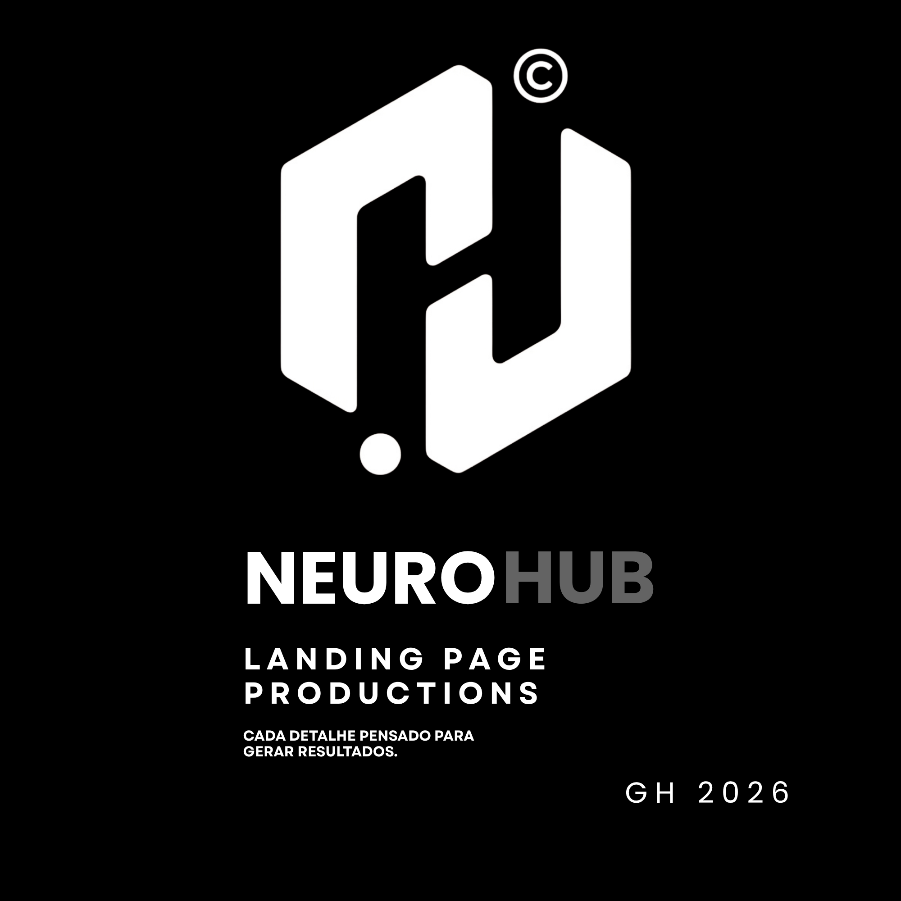
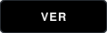

<!-- CABEÇALHO E BIO -->
<table width="100%" style="border: none; border-collapse: collapse;">
<tr>

<!-- Coluna de Texto -->
<td width="70%" valign="top" style="border: none;">

Seja bem-vindo(a) >_

<h1 style="margin-bottom: 0; border-bottom: none;">

</h1>

<h3 style="font-family: monospace; color: #58A6FF; font-weight: normal; margin-top:0;">
Motion Design • UI/UX • IA _
</h3>

Sou cofundador da Neurohub e atuo na criação de interfaces intuitivas e narrativas visuais que conectam o usuário aos objetivos do negócio. 
Aplico conceitos avançados de usabilidade para desenvolver experiências digitais fluidas, estratégicas e orientadas à conversão.

 

</td>

<!-- COLUNA DA DIREITA -->

<td width="30%" align="center" valign="middle">

  

</td>

</tr>
</table>

 

 

<!-- Figma -->
&nbsp;&nbsp;&nbsp;&nbsp;
<!-- Blender -->
&nbsp;&nbsp;&nbsp;&nbsp;
<!-- Photoshop -->
&nbsp;&nbsp;&nbsp;&nbsp;
<!-- Adobe Premiere Pro -->
&nbsp;&nbsp;&nbsp;&nbsp;
<!-- Adobe After Effects -->

<h3 style="font-family: monospace; color:#8B949E;font-weight:normal;text-transform:uppercase;">
🧠 Atualmente
</h3>

&nbsp;&nbsp;[ / ]&nbsp;&nbsp;Motion Design &amp; Video Editing 
&nbsp;&nbsp;[ &gt; ]&nbsp;&nbsp;Design de Interfaces Digitais 
&nbsp;&nbsp;[ # ]&nbsp;&nbsp;UI/UX, Interfaces Estratégicas &amp; Usabilidade 
&nbsp;&nbsp;[ % ]&nbsp;&nbsp;Inteligência Artificial Aplicada

